# Sell Estate

## Table Of Content

- [Introduction](#Introduction)
    - [Application link](#Application-link)
    - [Site Goals](#Site-Goals)
    - [Target Audience](#Target-Audience)
    - [User stories](#User-Stories)
    - [Features Planned](#Features-Planned)
- [Structure](#Structure)
    - [Features](#Features)
    - [Features left to Implement](#Features-Left-to-Implement)
- [Logical Flow](#Logical-Flow)
- [Database Design](#Database-Design)
- [Technologies](#Technologies)
- [Testing](#Testing)
    - [Functional Testing](#Functional-Testing)
    - [Pep8 Validation](#Pep8-Validation)
    - [Bugs and Fixes](#Bugs-and-Fixes)
- [Deployment](#Deployment)
    - [Version Control](#Version-Control)
    - [MongoDB Setup](#MongoDB-Setup)
    - [Heroku Deployment](#Heroku-Deployment)
- [Credits](#Credits)
  - [Content](#Content)

## Introduction

As a prospective real estate business person, I am inspired to create this pilot project to help beginner and small estate business persons keep track of their records. This project will help in adding new properties and clients acquired. It will also allow for updating the status and profit they make on property sales. There is also room for updating client's associated property with the help of setting a property reference.                                      

### View the deployed application [here](https://sell-estate.herokuapp.com/)

### Site Goals

* To provide a simple application for the site owner to keep track of their properties and clients.

### Target Audience

* Small estate businesses that want to keep track of their properties and clients.

### User Stories

* As a User, I would like to be able to easily find the various menus. In order for me to be able to view properties and clients details. I would also love to update, add, edit and or remove details.
* As a User, I would like to be able to manage my properties so that I can easily keep track of property details and be able to udpate, edit, add and or delete when neccessary. I would also love to easily find my property by their house number.
* As a User, I would like to be able to manage my clients' details so that I can add, delete, update and find clients easily by thier name when necessary.
* As a User, I would like to be able to return to the main menu without having to restart the application and also exit just by a tap.

### Features Planned

* Simple and easy to use application with clear navigation.
* Simple database storage for:
    * Add, list, update and delete functionality for properties.
    * Add, list, update and delete functionality for clients.
* Return to main menu option through sub menus.
* Exit easily by pressing 0 and enter.

## Structure

### Features

USER STORY

`
As a User, I would love to be able to easily find and understand the main menu so that I can at first know where exactly to get clients or properties information. In order for me to subsequently update, add or remove its details.
`

IMPLEMENTATION
* Main Menu
    * When the application starts, the sell estate logo witha copyright line underneath is displayed on the top of the main menu to introduce the user aesthetically to sell estate.
    * The main menu beneath the logo displays with the following options:
        * 1 - Properties
        * 2 - Clients
    * The user must input the correct corresponding number displayed on the menu. Else, they will be prompted to enter a numeric value while they are given another chance to re-enter a digit.
    * This feature will allow the user to easily access the sub menus to each category in order to perform the needed operations.

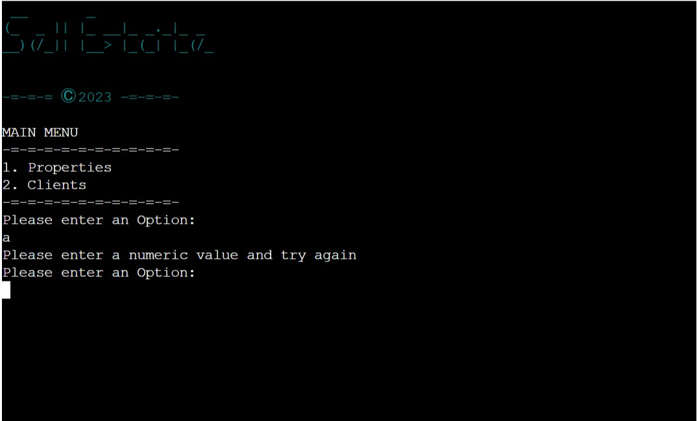

USER STORY

`
As a User, I would like to be able to manage my properties so that I can easily keep track of the properties I have available and view, update, add  and delete when neccessary.
`

IMPLEMENTATION
* Properties Menu
    * When the user selects properties from the main menu, the following menu options are displayed:
        * 1 - List All - This option displays all properties currently stored in mongoDB.
        * 2 - Update - This option will open the properties Update Menu, implementation described below.
        * 3 - Add new - This option will first ask the user to verify the prospective property by the house number. If the house number is not already recorded, User is allowed to enter the details of the new property and save it to the mongo database once all details are correctly input. Conversely, if the house number already exists, user is notified that he or she already has that property saved.
        * 4 - Delete - This option will allow the user to delete a property from MongoDB after verifying and confirming deletion.
        * 5 - Main Menu - This option will return the user to the main menu.
        * 0 - Exit - This option ends the program with a closing confirmation message.
    * The user must input a correct number corresponding to each menu or they will be alerted on an incorrect choice and the menu will be presented again.
    * This feature will allow the user to easily view, add, update and delete properties to and from mongoDB efficiently.

Properties Menu

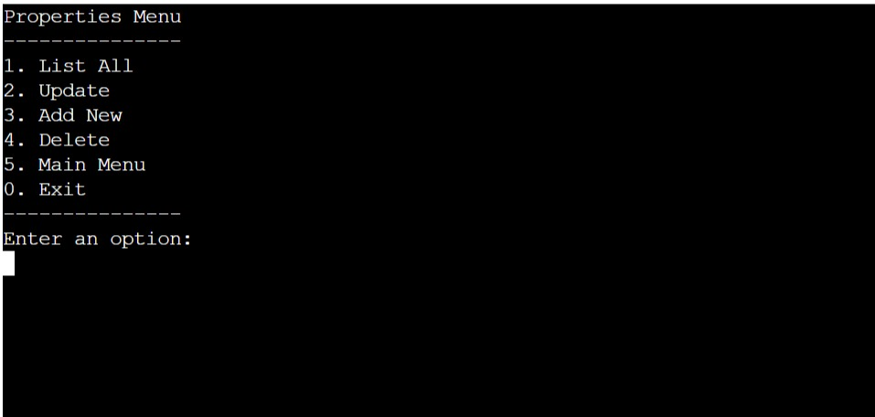

List All
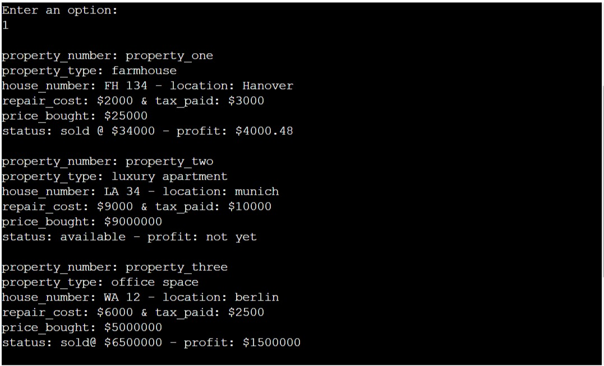                                                                                                           

* Property Update Menu
    * When the property update menu is selected, the following menu options display:
        * 1 - Update status - This will allow user to find a particular property by house number in order to update its status whether sold or still available. 
        * 2 - Update profit - This will allow user to find a particular property by house number in order to update its profit. 
        * 3 - Back to properties menu - This will allow the user to go back to the properties menu.
        * 4 - Main Menu - This option will return the user to the main menu.
        * 0 - Exit - This option ends the application with a closing confirmation message.

Property Update Menu
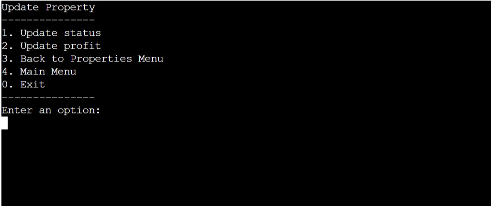

Update status
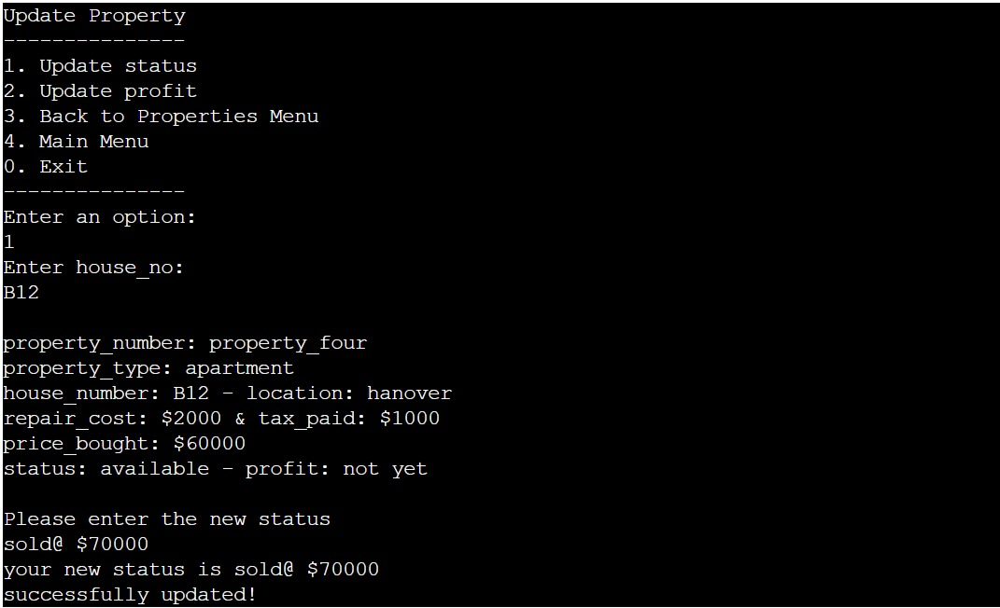

Update profit
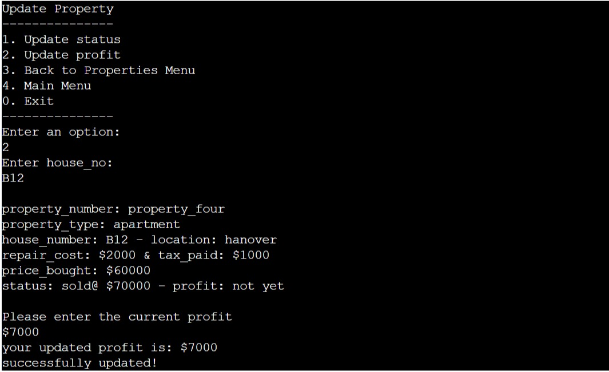                                                                                                 

Add new                                                                                                                                   
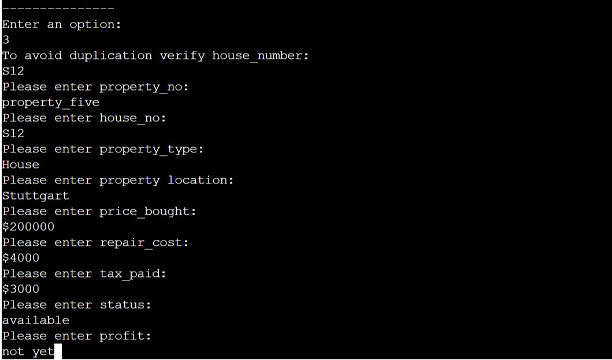
                                                                                                                                          
Delete                                                                                                                                   
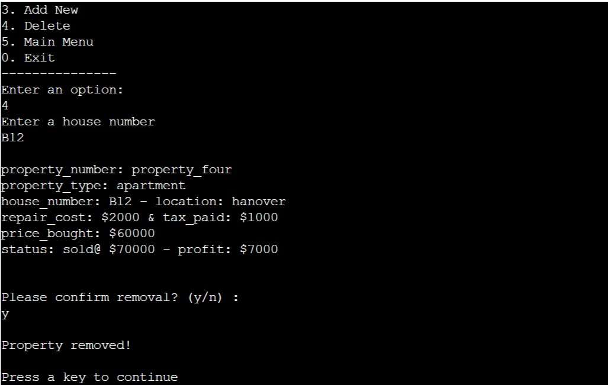

USER STORY

`
As a User, I would love to have an intact list of all my clients and the properties they are attached to. In order for me to view their details, update the properties linked to them and also add to the list and or delete when neccessary.

IMPLEMENTATION
* Clients Menu
    * When the user selects clients from the main menu, the following menu options are displayed:
        * 1 - List All - This option displays all clients currently stored in mongoDB.
        * 2 - Update - This option will open the clients Update Menu, implementation described below.
        * 3 - Add new - This option will first ask the user to verify the client by name. If the name is not already recorded, User is allowed to enter the details of the new client and save it to the mongo database once all details are correctly input. In contrast, if the name already exists, user is notified that he or she already has that particular client saved.
        * 4 - Delete - This option will allow the user to delete a client from MongoDB after verifying and confirming deletion.
        * 5 - Main Menu - This option will return the user to the main menu.
        * 0 - Exit - This option ends the program with a closing confirmation message.
    * The user must input a correct number corresponding to each menu or they will be alerted on an incorrect choice and the menu will be presented again.
    * This feature will allow the user to easily view, add, update and delete clients to and from mongoDB efficiently.

Clients Menu
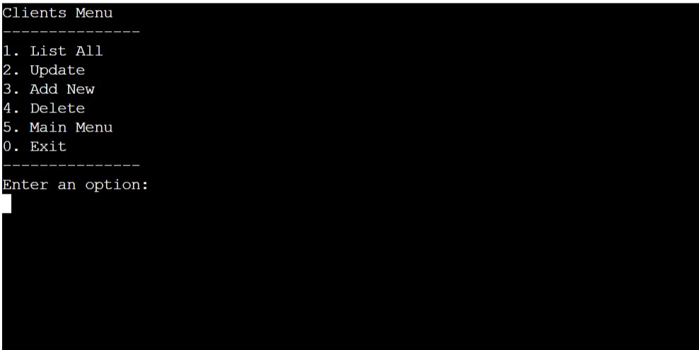

List All
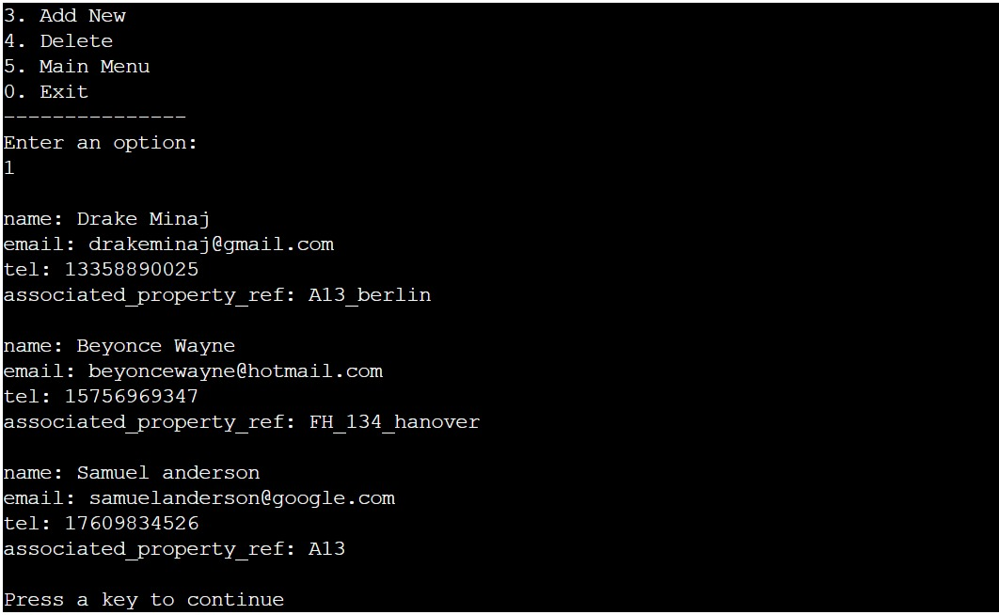

* Clients Update Menu
    * When the client update menu is selected, the following menu options display:
        * 1 - Update Property ref - This will allow user to find a particular client by name in order to update his or her associated property reference. 
        * 2 - Back to Clients Menu - This will allow the user to go back to the clients menu.
        * 3 - Main Menu - This option will return the user to the main menu.
        * 0 - Exit - This option ends the application with a closing confirmation message.

Clients Update Menu
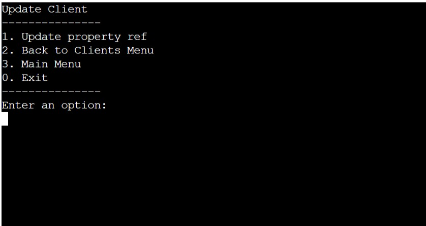
                                                                                                                                          
Update property ref
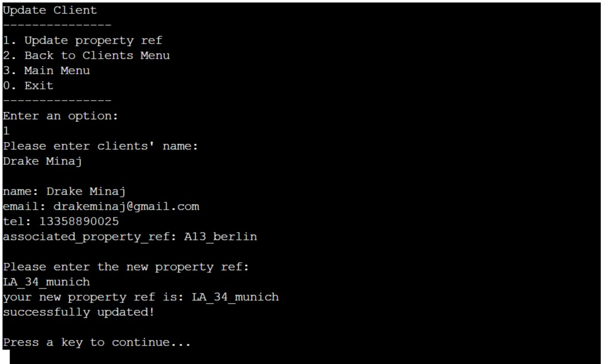

Add new                                                                                                                                   
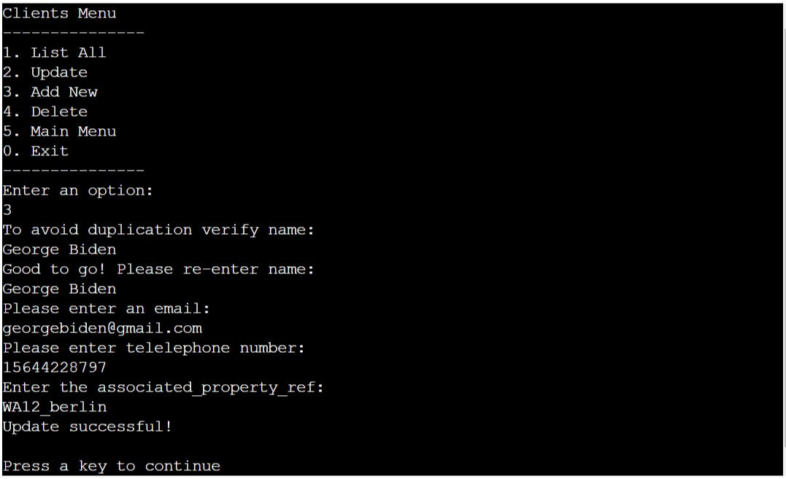
                                                                                                                                          
Delete                                                                                    
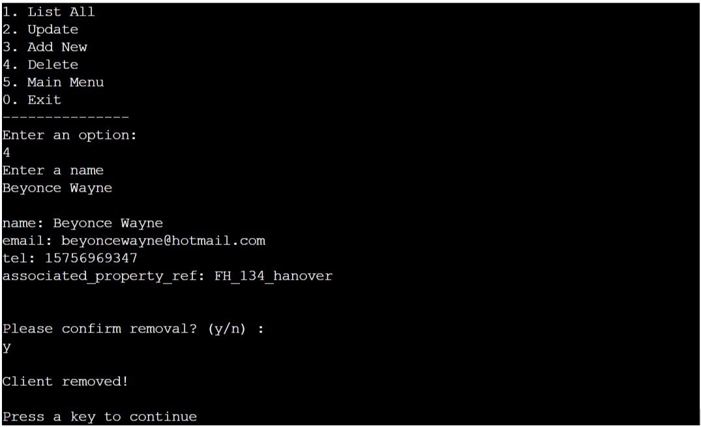

USER STORY

`
As a User, I would like to be able to return to the main menu and exit the application without having to restart the application.
`

IMPREMENTATION
* All sub menus have an option to return to the main menu and even other umbrella submenus as well. These are typically right above the exit option.
* This will allow the user to return to the main menu if they selected the wrong option or are done with the current menu.
* An exit option to end the application is also on all the sub menus for easy closing of the application.

This is evident on all the menu screenshots above.

**Error Handling**

Error handling was implemented throughout the application with the use of try/except statements to handle exceptions raised for things like None type values, Database connection errors Key and Value errors.
